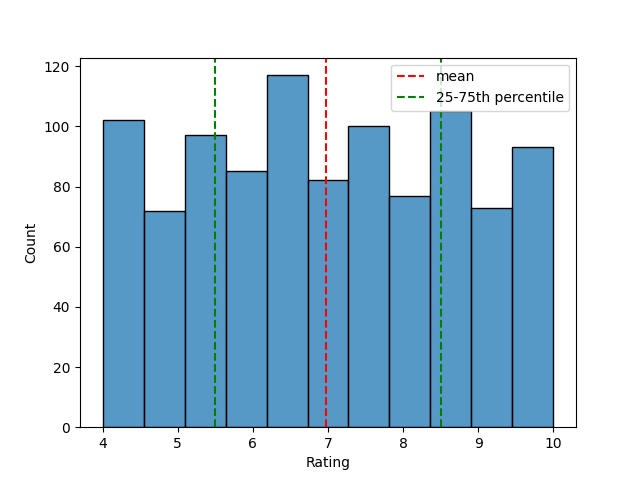
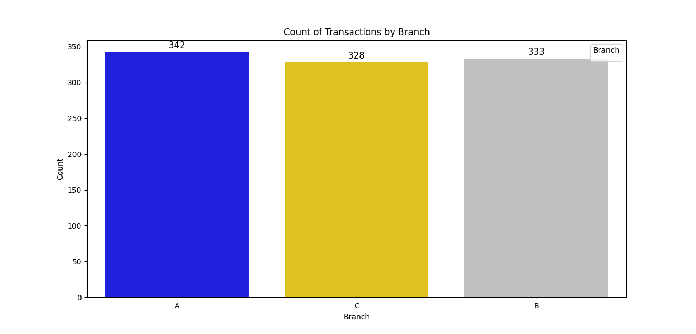
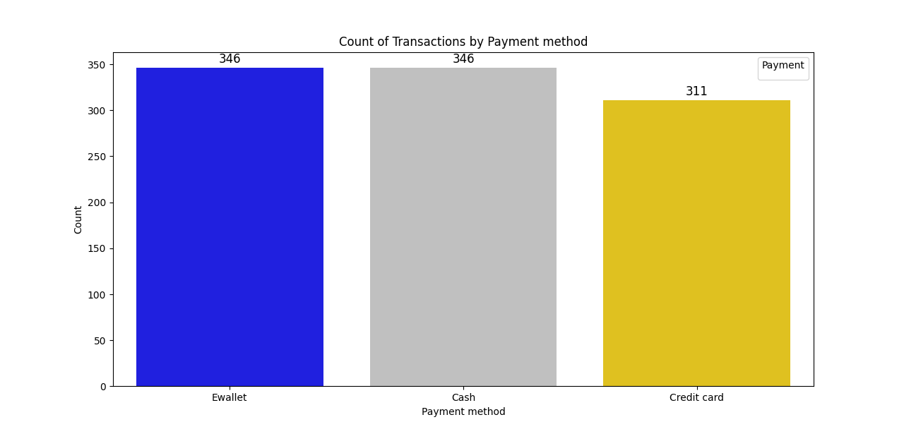
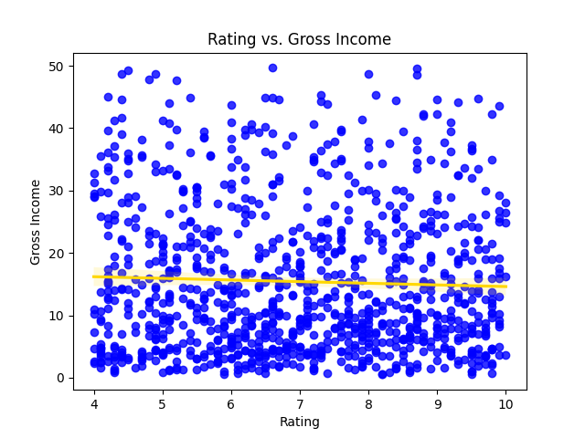
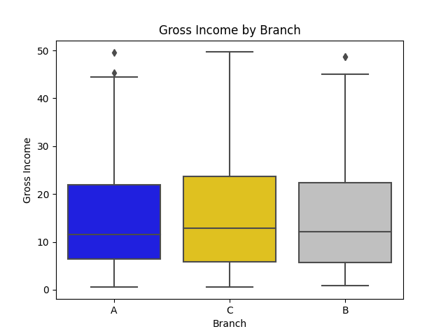
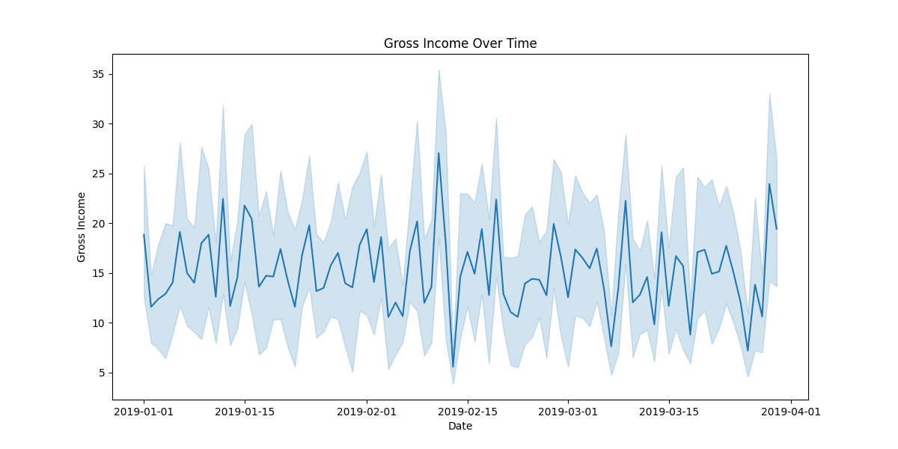
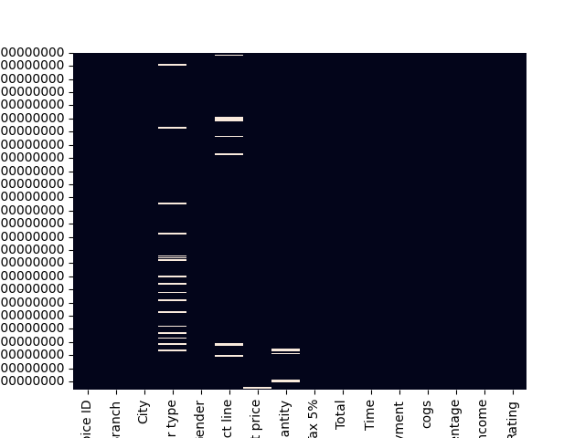
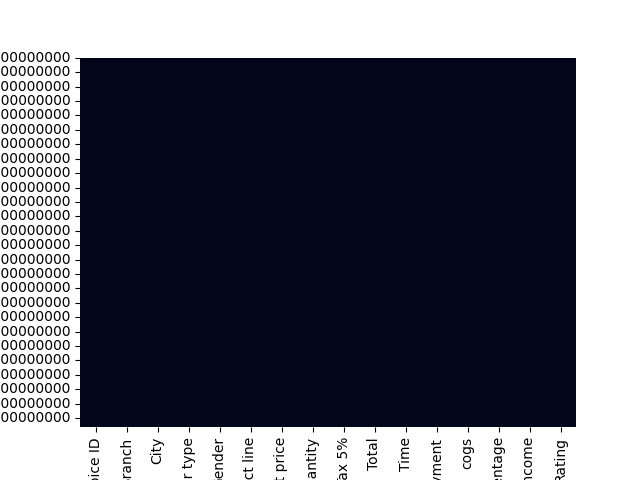
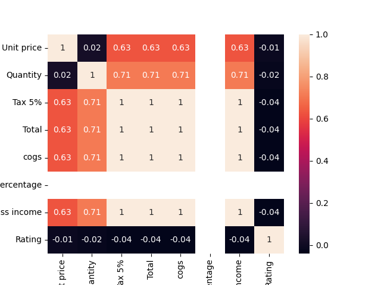

# Exploratory Data Analysis Project - Supermarket Sales

This project presents an exploratory data analysis (EDA) of a supermarket sales dataset. We will follow the structure of the code to explain each step and its corresponding analysis. It's important to clarify that the cleaning of this dataset was made at the end of the project for academic purposes only. The correct workflow should have the data-cleaning procces at the top of each exploratory data analysis.

## Data context

- Invoice id: Computer generated sales slip invoice identification number
- Branch: Branch of supercenter (3 branches are available identified by A, B and C).
- City: Location of supercenters
- Customer type: Type of customers, recorded by Members for customers using member card and Normal for without member card.
- Gender: Gender type of customer
- Product line: General item categorization groups - Electronic accessories, Fashion accessories, Food and beverages, Health and beauty, Home and lifestyle, Sports and travel
- Unit price: Price of each product in USD
- Quantity: Number of products purchased by customer
- Tax: 5% tax fee for customer buying
- Total: Total price including tax
- Date: Date of purchase (Record available from January 2019 to March 2019)
- Time: Purchase time (10am to 9pm)
- Payment: Payment used by customer for purchase (3 methods are available \u2013 Cash, Credit card and Ewallet)
- COGS: Cost of goods sold
- Gross margin percentage: Gross margin percentage
- Gross income: Gross income
- Rating: Customer stratification rating on their overall shopping experience (On a scale of 1 to 10)

## Data Loading and Preprocessing

We start by loading the dataset and performing some initial data preprocessing steps:

```python
import pandas as pd
import numpy as np
```
Load the dataset using pandas:

```python
df = pd.read_csv(r'..\supermarket_sales.csv')
```

Convert the 'Date' column to datetime and set the index of the pd.DataFrame as the Date for data management purposes:

```python
df['Date'] = pd.to_datetime(df['Date'], infer_datetime_format=True)
df.set_index('Date', inplace=True)
```

## Univariate Analysis

- Question 1: What does the distribution of customer ratings looks like? Is it skewed? 

We import the neccessary libraries for plotting the distribution of customer ratings and proceed to use seaborn 
and matplotlib for this purpose:

```python
Copy code
import matplotlib.pyplot as plt
import seaborn as sns


sns.histplot(df['Rating'])
plt.axvline(x=np.mean(df['Rating']), c='red', ls='--', label='mean')
plt.axvline(x=np.percentile(df['Rating'], 25), c='green', ls='--', label='25-75th percentile')
plt.axvline(x=np.percentile(df['Rating'], 75), c='green', ls='--')
plt.legend()
plt.show()
```



- Question 2: Do aggregate sales numbers differ by much between branches?


Plot count of transactions by branch

```python
custom_colors1 = {'A': 'blue', 'B': 'silver', 'C': 'gold'}
plt.figure(figsize=(10, 8))
sns.countplot(data=df, x='Branch', palette=custom_colors1)

for p in plt.gca().patches:
    plt.gca().annotate(f'{int(p.get_height())}', (p.get_x() + p.get_width() / 2., p.get_height()),
                       ha='center',
                       va='baseline',
                       fontsize=12,
                       color='black',
                       xytext=(0, 5),
                       textcoords='offset points')

plt.legend(title='Branch', loc='upper right')
plt.xlabel('Branch')
plt.ylabel('Count')
plt.title('Count of Transactions by Branch')
plt.show()
```



We analyze the count of transactions by payment method and visualize the results.

Plot count of transactions by payment method

```python
custom_colors2 = {'Ewallet': 'blue', 'Cash': 'silver', 'Credit card': 'gold'}
plt.figure(figsize=(10, 8))
sns.countplot(data=df, x='Payment', palette=custom_colors2)

for p in plt.gca().patches:
    plt.gca().annotate(f'{int(p.get_height())}', (p.get_x() + p.get_width() / 2., p.get_height()),
                       ha='center',
                       va='baseline',
                       fontsize=12,
                       color='black',
                       xytext=(0, 5),
                       textcoords='offset points')

plt.legend(title='Payment', loc='upper right')
plt.xlabel('Payment method')
plt.ylabel('Count')
plt.title('Count of Transactions by Payment method')
plt.show()
```



## Bivariate Analysis

- Question 3: Is there a relationship between gross income and customer ratings?

We explore the relationship between gross income and customer ratings using a scatter plot with a regression line.

```python
sns.regplot(x='Rating', y='gross income', data=df, scatter_kws={'color': 'blue'}, line_kws={'color': 'gold'})
plt.xlabel('Rating')
plt.ylabel('Gross Income')
plt.title('Rating vs. Gross Income')
plt.show()
```



Gross Income by Branch
We visualize the gross income distribution across different branches using a boxplot.

```python
custom_colors3 = {'A': 'blue', 'B': 'silver', 'C': 'gold'}
sns.boxplot(x=df['Branch'], y=df['gross income'], palette=custom_colors3)
plt.xlabel('Branch')
plt.ylabel('Gross Income')
plt.title('Gross Income by Branch')
plt.show()
```



- Question 4: Is there a noticeable time trend in gross income?

We check for a noticeable time trend in gross income by plotting it over time.

```python
plt.figure(figsize=(12, 6))
sns.lineplot(x=df.index, y='gross income', data=df)
plt.title('Gross Income Over Time')
plt.xlabel('Date')
plt.ylabel('Gross Income')
plt.show()
```



## Dealing with Duplicate Rows and Missing Values

We handle duplicate rows and missing values in the dataset.


- Check for duplicate rows

```python
df.duplicated()
df.duplicated().sum()
```

- Remove duplicate rows

```python
df.drop_duplicates(inplace=True)
```

- Counting and visualizing missing values using seaborn's heatmap

```python
print(df.isna().sum())
sns.heatmap(df.isnull(), cbar=False)
plt.show()
```



- Handling missing values in the dataset

```python
numerical_columns = df.select_dtypes(include=['float64', 'int64']).columns
categorical_columns = df.select_dtypes(include=['object']).columns

df[numerical_columns] = df[numerical_columns].fillna(df[numerical_columns].mean())
df[categorical_columns] = df[categorical_columns].fillna(df[categorical_columns].mode().iloc[0])

sns.heatmap(df.isnull(), cbar=False)
plt.show()
```



## Data Profiling

For a more comprehensive overview of the dataset, we generate a data profiling report in HTML format.

```python
dataset = pd.read_csv('supermarket_sales.csv')
prof = ProfileReport(dataset)
prof.to_file("report.html")
```

## Correlation Analysis
We calculate the correlation matrix and create a heatmap to visualize the relationships between numeric features.

```python
numeric_columns = [
    'Unit price',
    'Quantity',
    'Tax 5%',
    'Total',
    'cogs',
    'gross margin percentage',
    'gross income',
    'Rating']

numeric_df = df[numeric_columns]

correlation_matrix = numeric_df.corr().round(2)

sns.heatmap(np.round(numeric_df.corr(), 2), annot=True)
plt.show()
```


